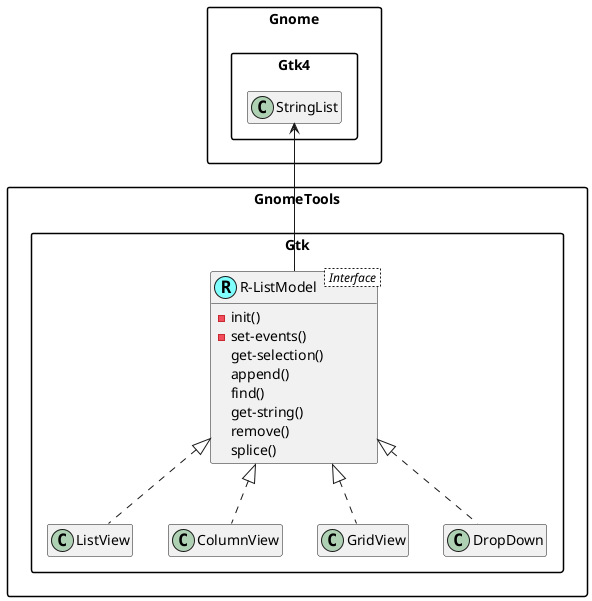
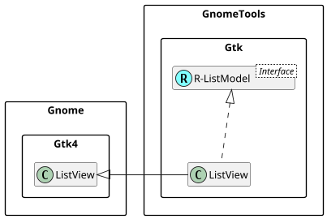
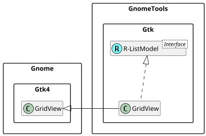
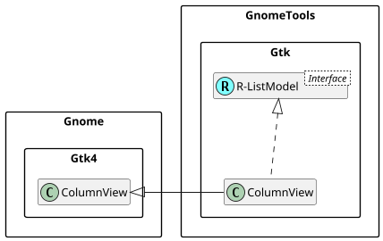
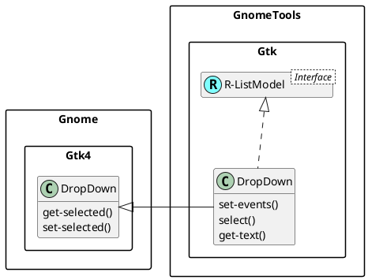

```plantuml
@startuml
'scale 0.8

skinparam packageStyle rectangle
skinparam stereotypeCBackgroundColor #80ffff
set namespaceSeparator ::
hide empty members

class Gnome::Gtk4::StringList {
}

Interface GnomeTools::Gtk::R-ListModel < Interface >
class GnomeTools::Gtk::R-ListModel <<(R,#80ffff)>> {
  -init()
  -set-events()
  get-selection()
  append()
  find()
  get-string()
  remove()
  splice()
}

"Gnome::Gtk4::StringList" <-- "GnomeTools::Gtk::R-ListModel"

"GnomeTools::Gtk::R-ListModel" <|.. "GnomeTools::Gtk::ListView"
"GnomeTools::Gtk::R-ListModel" <|.. "GnomeTools::Gtk::ColumnView"
"GnomeTools::Gtk::R-ListModel" <|.. "GnomeTools::Gtk::GridView"
"GnomeTools::Gtk::R-ListModel" <|.. "GnomeTools::Gtk::DropDown"
@enduml
```

```plantuml
@startuml
scale 0.9

skinparam packageStyle rectangle
skinparam stereotypeCBackgroundColor #80ffff
set namespaceSeparator ::
hide empty members

Interface GnomeTools::Gtk::R-ListModel < Interface >
class GnomeTools::Gtk::R-ListModel <<(R,#80ffff)>>

"GnomeTools::Gtk::R-ListModel" <|.. "GnomeTools::Gtk::ListView"
'"GnomeTools::Gtk::R-ListEventModel" <|.. "GnomeTools::Gtk::ListView"
"Gnome::Gtk4::ListView" <|- "GnomeTools::Gtk::ListView"

@enduml
```

```plantuml
@startuml
scale 0.9

skinparam packageStyle rectangle
skinparam stereotypeCBackgroundColor #80ffff
set namespaceSeparator ::
hide empty members

Interface GnomeTools::Gtk::R-ListModel < Interface >
'Interface GnomeTools::Gtk::R-ListEventModel < Interface >
class GnomeTools::Gtk::R-ListModel <<(R,#80ffff)>>
'class GnomeTools::Gtk::R-ListEventModel <<(R,#80ffff)>>

"GnomeTools::Gtk::R-ListModel" <|.. "GnomeTools::Gtk::GridView"
'"GnomeTools::Gtk::R-ListEventModel" <|.. "GnomeTools::Gtk::GridView"
"Gnome::Gtk4::GridView" <|- "GnomeTools::Gtk::GridView"
@enduml
```

```plantuml
@startuml
scale 0.9

skinparam packageStyle rectangle
skinparam stereotypeCBackgroundColor #80ffff
set namespaceSeparator ::
hide empty members

Interface GnomeTools::Gtk::R-ListModel < Interface >
'Interface GnomeTools::Gtk::R-ListEventModel < Interface >
'class GnomeTools::Gtk::R-ListEventModel <<(R,#80ffff)>>
class GnomeTools::Gtk::R-ListModel <<(R,#80ffff)>>

"GnomeTools::Gtk::R-ListModel" <|.. "GnomeTools::Gtk::ColumnView" 
'"GnomeTools::Gtk::R-ListEventModel" <|.. "GnomeTools::Gtk::ColumnView" 
"Gnome::Gtk4::ColumnView" <|- "GnomeTools::Gtk::ColumnView"

@enduml
```

```plantuml
@startuml
'scale 0.8

skinparam packageStyle rectangle
skinparam stereotypeCBackgroundColor #80ffff
set namespaceSeparator ::
hide empty members

Interface GnomeTools::Gtk::R-ListModel < Interface >
class GnomeTools::Gtk::R-ListModel <<(R,#80ffff)>>
class Gnome::Gtk4::DropDown {
  get-selected()
  set-selected()
}

class GnomeTools::Gtk::DropDown {
  set-events()
  select()
  get-text()
}

"GnomeTools::Gtk::R-ListModel" <|.. "GnomeTools::Gtk::DropDown" 
"Gnome::Gtk4::DropDown" <|- "GnomeTools::Gtk::DropDown"

@enduml
```
