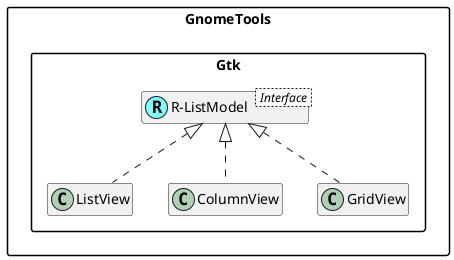
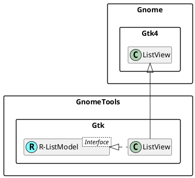
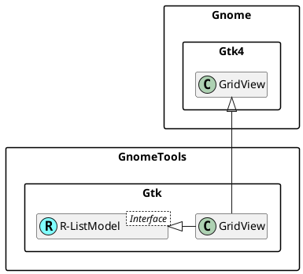
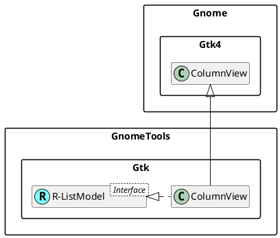
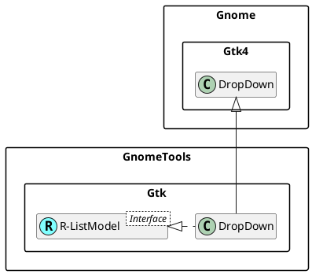

```plantuml
@startuml
'scale 0.8

skinparam packageStyle rectangle
skinparam stereotypeCBackgroundColor #80ffff
set namespaceSeparator ::
hide members

Interface GnomeTools::Gtk::R-ListModel < Interface >
class GnomeTools::Gtk::R-ListModel <<(R,#80ffff)>>

"GnomeTools::Gtk::R-ListModel" <|.. "GnomeTools::Gtk::ListView"
"GnomeTools::Gtk::R-ListModel" <|.. "GnomeTools::Gtk::ColumnView"
"GnomeTools::Gtk::R-ListModel" <|.. "GnomeTools::Gtk::GridView"
@enduml
```

```plantuml
@startuml
'scale 0.8

skinparam packageStyle rectangle
skinparam stereotypeCBackgroundColor #80ffff
set namespaceSeparator ::
hide members

Interface GnomeTools::Gtk::R-ListModel < Interface >
class GnomeTools::Gtk::R-ListModel <<(R,#80ffff)>>

"GnomeTools::Gtk::R-ListModel" <|. "GnomeTools::Gtk::ListView"
"Gnome::Gtk4::ListView" <|-- "GnomeTools::Gtk::ListView"

@enduml
```

```plantuml
@startuml
'scale 0.8

skinparam packageStyle rectangle
skinparam stereotypeCBackgroundColor #80ffff
set namespaceSeparator ::
hide members

Interface GnomeTools::Gtk::R-ListModel < Interface >
class GnomeTools::Gtk::R-ListModel <<(R,#80ffff)>>

"GnomeTools::Gtk::R-ListModel" <|- "GnomeTools::Gtk::GridView"
"Gnome::Gtk4::GridView" <|-- "GnomeTools::Gtk::GridView"
@enduml
```

```plantuml
@startuml
'scale 0.8

skinparam packageStyle rectangle
skinparam stereotypeCBackgroundColor #80ffff
set namespaceSeparator ::
hide members

Interface GnomeTools::Gtk::R-ListModel < Interface >
class GnomeTools::Gtk::R-ListModel <<(R,#80ffff)>>

"GnomeTools::Gtk::R-ListModel" <|. "GnomeTools::Gtk::ColumnView" 
"Gnome::Gtk4::ColumnView" <|-- "GnomeTools::Gtk::ColumnView"

@enduml
```

```plantuml
@startuml
'scale 0.8

skinparam packageStyle rectangle
skinparam stereotypeCBackgroundColor #80ffff
set namespaceSeparator ::
hide members

Interface GnomeTools::Gtk::R-ListModel < Interface >
class GnomeTools::Gtk::R-ListModel <<(R,#80ffff)>>

"GnomeTools::Gtk::R-ListModel" <|. "GnomeTools::Gtk::DropDown" 
"Gnome::Gtk4::DropDown" <|-- "GnomeTools::Gtk::DropDown"

@enduml
```
